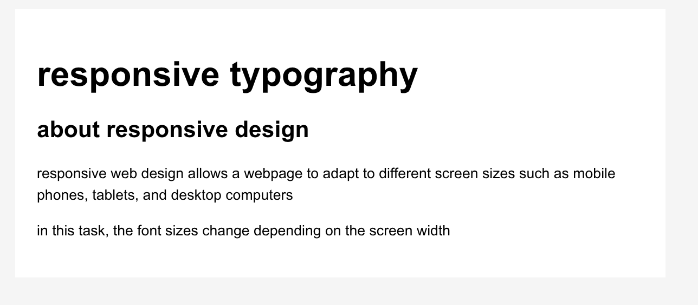
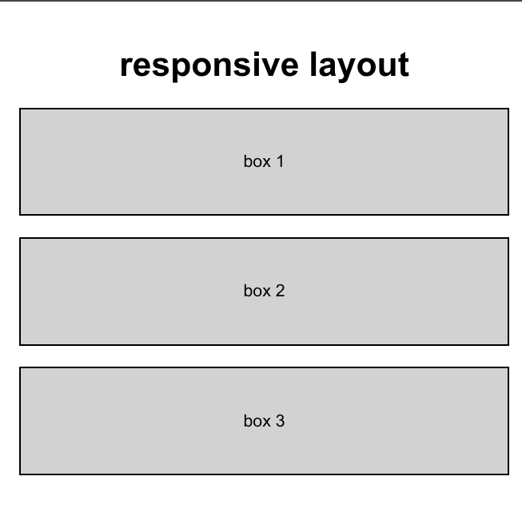
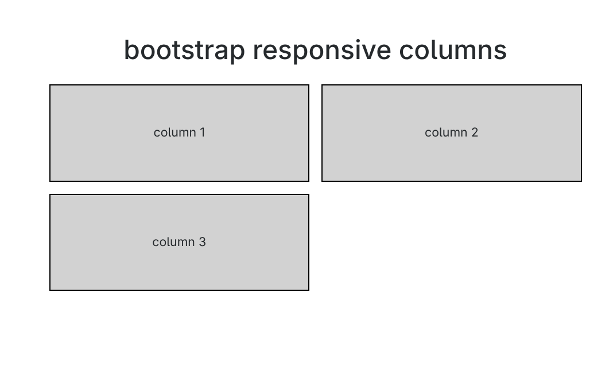
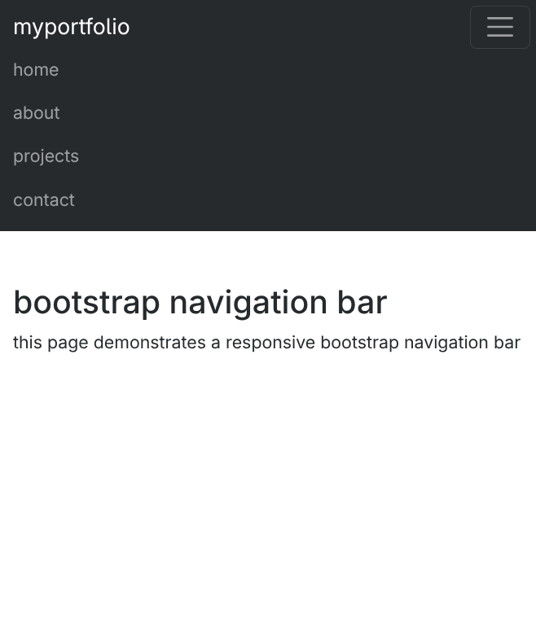
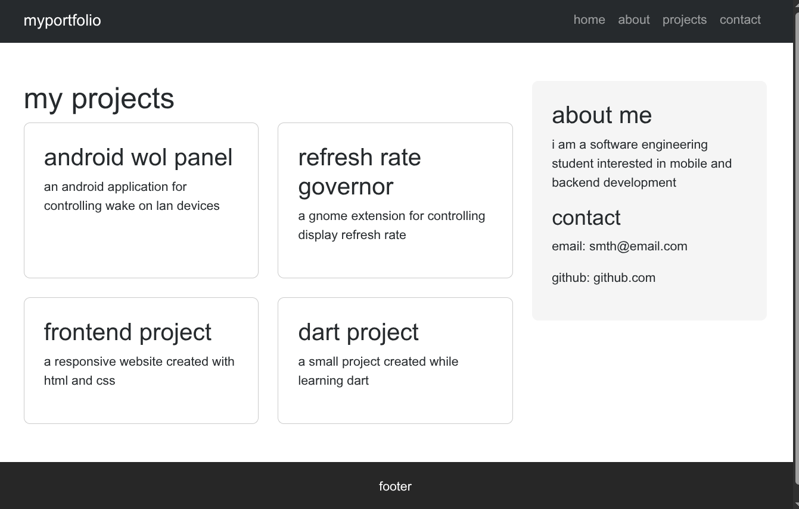

# Assignment #3: Responsive Web Design

**Name:** Aldiyar Kairollin  
**Group:** SE-2539

## Part 1: Media Queries

### Task 0: Responsive Typography

Created a responsive webpage with headings and paragraphs. Media queries are used to change font sizes for mobile, tablet, and desktop screen sizes.

### Task 1: Responsive Layout with Media Queries

Created a responsive layout with three boxes using CSS Flexbox and media queries. On desktop, the boxes are displayed in one row. On tablet, two boxes are displayed in the first row and one in the second row. On mobile, all boxes are stacked vertically.

## Part 2: Bootstrap Grid System

### Task 2: Bootstrap Responsive Columns

Created a responsive layout using the Bootstrap 12-column grid. On desktop, three equal columns are displayed. On tablet, two columns are displayed in the first row and one in the second row. On mobile, all columns are stacked.

### Task 3: Bootstrap Navigation Bar

Created a responsive Bootstrap navigation bar with a logo on the left and navigation links on the right. On smaller screens, the navigation links collapse into a hamburger menu.

## Part 3: Combined Project

### Task 4: Responsive Portfolio Page

Created a responsive portfolio page using Bootstrap Grid and CSS Media Queries. The page contains a Bootstrap navbar, portfolio project cards, a personal information sidebar, contact details, and a footer. Media queries are used to adjust font sizes, spacing, and layout for different screen sizes.

## Conclusion

The project was created step by step. First, CSS media queries were used for responsive typography and layouts. Bootstrap Grid and a responsive navbar were then implemented. Finally, these techniques were combined to create a responsive portfolio page. The pages were tested on different screen sizes.